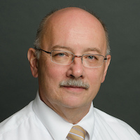
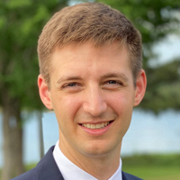

# FEM@LLNL Seminar Series

We are happy to announce a new FEM@LLNL seminar series, starting in 2022, which will focus on finite element research and applications talks of interest to the MFEM community. We have lined up some excellent speakers for our first year and plan to keep adding more. Videos will be added to a [YouTube playlist](https://www.youtube.com/playlist?list=PLy9rIbGDXrG1Lfy3Um-KEPqFae7Ipghqj) as well as this site's [videos page](videos.md).

### <i class="fa fa-envelope-o" aria-hidden="true"></i> Sign-Up

Fill in [this form](https://docs.google.com/forms/d/e/1FAIpQLScrJ9QT7v7abx2ELcETKJnhWaU7_Wa2V3d7WIPdf3_JYK4JmA/viewform?usp=sf_link) to sign-up for future FEM@LLNL seminar announcements.

---

### <i class="fa fa-star"></i> Next Talk

#### Nat Trask (University of Pennsylvania)
##### *A Data Driven Finite Element Exterior Calculus*
##### [**11am PDT, Apr 2, 2024**](https://everytimezone.com/s/d77141cc)

[<button type="button" class="btn btn-success">
**Webex**
</button>](TBD)

**Abstract:** Despite the recent flurry of work employing machine learning to develop surrogate models to accelerate scientific computation, the "black-box" underpinnings of current techniques fail to provide the verification and validation guarantees provided by modern finite element methods. In this talk we present a data-driven finite element exterior calculus for developing reduced-order models of multiphysics systems when the governing equations are either unknown or require closure. The framework employs deep learning architectures typically used for logistic classification to construct a trainable partition of unity which provides notions of control volumes with associated boundary operators. This alternative to a traditional finite element mesh is fully differentiable and allows construction of a discrete de Rham complex with a corresponding Hodge theory. We demonstrate how models may be obtained with the same robustness guarantees as traditional mixed finite element discretization, with deep connections to contemporary techniques in graph neural networks. For applications developing digital twins where surrogates are intended to support real time data assimilation and optimal control, we further develop the framework to support Bayesian optimization of unknown physics on the underlying adjacency matrices of the chain complex. By framing the learning of fluxes via an optimal recovery problem with a computationally tractable posterior distribution, we are able to develop models with intrinsic representations of epistemic uncertainty.

---

### <i class="fa fa-check" aria-hidden="true"></i> Previous Talks

#### William Moses (University of Illinois Urbana-Champaign)
##### *Supercharging Programming Through Compiler Technology*
##### Mar 14, 2024

[<button type="button" class="btn btn-primary">
**Slides**
</button>](pdf/seminar/moses.pdf)
&nbsp;&nbsp;
[<button type="button" class="btn btn-success">
**Talk Recording**
</button>](TBD)

**Abstract:** The decline of Moore's law and an increasing reliance on computation has led to an explosion of specialized software packages and hardware architectures. While this diversity enables unprecedented flexibility, it also requires domain-experts to learn how to customize programs to efficiently leverage the latest platform-specific API's and data structures, instead of working on their intended problem. Rather than forcing each user to bear this burden, I propose building high-level abstractions within general-purpose compilers that enable fast, portable, and composable programs to be automatically generated.

This talk will demonstrate this approach through compilers that I built for two domains: automatic differentiation and parallelism. These domains are critical to both scientific computing and machine learning, forming the basis of neural network training, uncertainty quantification, and high-performance computing. For example, a researcher hoping to incorporate their climate simulation into a machine learning model must also provide a corresponding derivative simulation. My compiler, Enzyme, automatically generates these derivatives from existing computer programs, without modifying the original application. Moreover, operating within the compiler enables Enzyme to combine differentiation with program optimization, resulting in asymptotically and empirically faster code. Looking forward, this talk will also touch on how this domain-agnostic compiler approach can be applied to new directions, including probabilistic programming.

#### Sungho Lee (University of Memphis)
##### *LAGHOST: Development of Lagrangian High-Order Solver for Tectonics*
##### March 5, 2024

[<button type="button" class="btn btn-primary">
**Slides**
</button>](pdf/seminar/lee.pdf)
&nbsp;&nbsp;
[<button type="button" class="btn btn-success">
**Talk Recording**
</button>](TBD)

**Abstract:** Long-term geological and tectonic processes associated with large deformation highlight the importance of using a moving Lagrangian frame. However, modern advancements in the finite element method, such as MPI parallelization, GPU acceleration, high-order elements, and adaptive grid refinement for tectonics based on this frame, have not been updated. Moreover, the existing solvers available in open access suffer from limited tutorials, a poor user manual, and several dependencies that make model building complex. These limitations can discourage both new users and developers from utilizing and improving these models. As a result, we are motivated to develop a user-friendly, Lagrangian thermo-mechanical numerical model that incorporates visco-elastoplastic rheology to simulate long-term tectonic processes like mountain building,  mantle convection and so on. We introduce an ongoing project called LAGHOST (Lagrangian High-Order Solver for Tectonics), which is an MFEM-based tectonic solver. LAGHOST expands the capabilities of MFEM's LAGHOS mini-app. Currently, our solver incorporates constitutive equation, body force, mass scaling, dynamic relaxation, Mohr-Coulomb plasticity, plastic softening, Winkler foundation, remeshing, and remapping. To evaluate LAGHOST, we conducted four benchmark tests. The first test involved compressing an elastic box at a constant velocity, while the second test focused on the compaction of a self-weighted elastic column. To enable larger time-step sizes and achieve quasi-static solutions in the benchmarks, we introduced a fictitious density and implemented dynamic relaxation. This involved scaling the density factor and introducing a portion of force component opposing the previous velocity direction at nodal points. Our results exhibited good agreement with analytical solutions. Subsequently, we incorporated Mohr-Coulomb plasticity, a reliable model for predicting rock failure, into LAGHOST. We revisited the elastic box benchmark and considered plastic materials. By considering stress correction arising from plastic yielding, we confirmed that the updated solution from elastic guess aligned with the analytical solution. Furthermore, we applied LAGHOST to simulate the evolution of a normal fault, a significant tectonic phenomenon. To model normal fault evolution, we introduced strain softening on cohesion as the dominant factor based on geological evidence. Our simulations successfully captured the normal fault's evolution, with plastic strain localizing at shallow depths before propagating deeper. The fault angle reached approximately 60 degrees, in line with the Mohr-Coulomb failure theory.

#### Kevin Chung (LLNL)
##### *Data-Driven DG FEM Via Reduced Order Modeling and Domain Decomposition*
##### February 6, 2024

[<button type="button" class="btn btn-primary">
**Slides**
</button>](pdf/seminar/chung.pdf)
&nbsp;&nbsp;
[<button type="button" class="btn btn-success">
**Talk Recording**
</button>](https://www.youtube.com/watch?v=CfRSzUOM0Ug)

**Abstract:** Numerous cutting-edge scientific technologies originate at the laboratory scale, but transitioning them to practical industry applications can be a formidable challenge. Traditional pilot projects at intermediate scales are costly and time-consuming. Alternatives such as E-pilots can rely on high-fidelity numerical simulations, but even these simulations can be computationally prohibitive at larger scales. To overcome these limitations, we propose a scalable, component reduced order model (CROM) method. We employ Discontinuous Galerkin Domain Decomposition (DG-DD) to decompose the physics governing equation for a large-scale system into repeated small-scale unit components. Critical physics modes are identified via proper orthogonal decomposition (POD) from small-scale unit component samples. The computationally expensive, high-fidelity discretization of the physics governing equation is then projected onto these modes to create a reduced order model (ROM) that retains essential physics details. The combination of DG-DD and POD enables ROMs to be used as building blocks comprised of unit components and interfaces, which can then be used to construct a global large-scale ROM without data at such large scales. This method is demonstrated on the Poisson and Stokes flow equations, showing that it can solve equations about 15−40 times faster with only ∼ 1% relative error, even at scales 1000 times larger than the unit components. This research is ongoing, with efforts to apply these methods to more complex physics such as Navier-Stokes equation, highlighting their potential for transitioning laboratory-scale technologies to practical industrial use.

#### Brian Young
##### *A Full-Wave Electromagnetic Simulator for Frequency-Domain S-Parameter Calculations*
##### January 9, 2024

[<button type="button" class="btn btn-primary">
**Slides**
</button>](pdf/seminar/young.pdf)
&nbsp;&nbsp;
[<button type="button" class="btn btn-success">
**Talk Recording**
</button>](https://www.youtube.com/watch?v=uknQqYw-d0o)

**Abstract:** An open-source and free full-wave electromagnetic simulator is presented that addresses the engineering community’s need for the calculation of frequency-domain S-parameters. Two-dimensional port simulations are used to excite the 3D space and to extract S-parameters using modal projections. Matrix solutions are performed using complex computations. Features enabled by the MFEM library include adaptive mesh refinement, arbitrary order finite elements, and parallel processing using MPI. Implementation details are presented along with sample results and accuracy demonstrations.

#### Jesse Chan (Rice University)
##### *High order positivity-preserving entropy stable discontinuous Galerkin discretizations*
##### December 5, 2023

[<button type="button" class="btn btn-primary">
**Slides**
</button>](pdf/seminar/chan.pdf)
&nbsp;&nbsp;
[<button type="button" class="btn btn-success">
**Talk Recording**
</button>](https://www.youtube.com/watch?v=x33D171lXjc)

**Abstract:** High order discontinuous Galerkin (DG) methods provide high order accuracy and geometric flexibility, but are known to be unstable when applied to nonlinear conservation laws whose solutions exhibit shocks and under-resolved solution features. Entropy stable schemes improve robustness by ensuring that physically relevant solutions satisfy a semi-discrete cell entropy inequality independently of numerical resolution and solution regularization while retaining formal high order accuracy. In this talk, we will review the construction of entropy stable high order discontinuous Galerkin methods and describe approaches for enforcing that solutions are "physically relevant" (i.e., the thermodynamic variables remain positive).

#### Youngsoo Choi (Lawrence Livermore National Laboratory)
##### *Physics-guided interpretable data-driven simulations*
##### November 14, 2023

[<button type="button" class="btn btn-primary">
**Slides**
</button>](pdf/seminar/choi.pdf)
&nbsp;&nbsp;
[<button type="button" class="btn btn-success">
**Talk Recording**
</button>](https://www.youtube.com/watch?v=nWOC_BR3x-8)

**Abstract:** A computationally demanding physical simulation often presents a significant impediment to scientific and technological progress. Fortunately, recent advancements in machine learning (ML) and artificial intelligence have given rise to data-driven methods that can expedite these simulations. For instance, a well-trained 2D convolutional deep neural network can provide a 100,000-fold acceleration in solving complex problems like Richtmyer-Meshkov instability [[1](https://arxiv.org/abs/2208.11477)]. However, conventional black-box ML models lack the integration of fundamental physics principles, such as the conservation of mass, momentum, and energy. Consequently, they often run afoul of critical physical laws, raising concerns among physicists. These models attempt to compensate for the absence of physics information by relying on vast amounts of data. Additionally, they suffer from various drawbacks, including a lack of structure-preservation, computationally intensive training phases, reduced interpretability, and susceptibility to extrapolation issues. To address these shortcomings, we propose an approach that incorporates physics into the data-driven framework. This integration occurs at different stages of the modeling process, including the sampling and model-building phases. A physics-informed greedy sampling procedure minimizes the necessary training data while maintaining target accuracy [[2](https://arxiv.org/abs/2204.12005)]. A physics-guided data-driven model not only preserves the underlying physical structure more effectively but also demonstrates greater robustness in extrapolation compared to traditional black-box ML models. We will showcase numerical results in areas such as hydrodynamics [[3](https://arxiv.org/abs/2104.11404),[4](https://arxiv.org/abs/2009.11990)], particle transport [[5](https://doi.org/10.1016/j.jcp.2020.109845)], plasma physics, pore-collapse, and 3D printing to highlight the efficacy of these data-driven approaches. The advantages of these methods will also become apparent in multi-query decision-making applications, such as design optimization [[6](https://doi.org/10.1016/j.cma.2021.113813),[7](https://doi.org/10.1016/j.jcp.2020.109787)].

#### Ben Southworth (Los Alamos National Laboratory)
##### *Superior discretizations and AMG solvers for extremely anisotropic diffusion via hyperbolic operators*
##### October 17, 2023

[<button type="button" class="btn btn-primary">
**Slides**
</button>](pdf/seminar/southworth.pdf)
&nbsp;&nbsp;
[<button type="button" class="btn btn-success">
**Talk Recording**
</button>](https://www.youtube.com/watch?v=MZ9qPFbWw68)

**Abstract:** Heat conduction in magnetic confinement fusion can reach anisotropy ratios of 10^9-10^10, and in complex problems the direction of anisotropy may not be aligned with (or is impossible to align with) the spatial mesh. Such problems pose major challenges for both discretization accuracy and efficient implicit linear solvers. Although the underlying problem is elliptic or parabolic in nature, we argue that the problem is better approached from the perspective of hyperbolic operators. The problem is posed in a directional gradient first order formulation, introducing a directional heat flux along magnetic field lines as an auxiliary variable. We then develop novel continuous and discontinuous discretizations of the mixed system, using stabilization techniques developed for hyperbolic problems. The resulting block matrix system is then reordered so that the advective operators are on the diagonal, and the system is solved using AMG based on approximate ideal restriction (AIR), which is particularly efficient for upwind discretizations of advection. Compared with traditional discretizations and AMG solvers, we achieve orders of magnitude reduction in error and AMG iterations in the extremely anisotropic regime.

#### Natasha Sharma (University of Texas at El Paso)
##### *A Continuous Interior Penalty Method Framework for Sixth Order Cahn-Hilliard-type Equations with applications to microstructure evolution and microemulsions*
##### July 18, 2023

[<button type="button" class="btn btn-primary">
**Slides**
</button>](pdf/seminar/sharma.pdf)
&nbsp;&nbsp;
[<button type="button" class="btn btn-success">
**Talk Recording**
</button>](https://www.youtube.com/watch?v=5O4Uv9agXHU)

**Abstract:** The focus of this talk is on presenting unconditionally stable, uniquely solvable, and convergent numerical methods to solve two classes of the sixth-order Cahn-Hilliard-type equations. The first class arises as the so-called phase field crystal atomistic model of crystal growth, which has been employed to simulate a number of physical phenomena such as crystal growth in a supercooled liquid, crack propagation in ductile material, dendritic and eutectic solidification. The second class, henceforth referred to as Microemulsion systems (ME systems) appears as a model capturing the dynamics of phase transitions in ternary oil-water-surfactant systems in which three phases namely a microemulsion, almost pure oil, and almost pure water can coexist in equilibrium. ME systems have several applications ranging from enhanced oil recovery to the development of environmentally friendly solvents and drug delivery systems. Despite the widespread applications of these models, the major challenge impeding their use has been and continues to be a lack of understanding of the complex systems which they model. Thus, building computational models for these systems is crucial to the understanding of these systems. The presence of the higher order derivative in combination with a time-dependent process poses many challenges to the creation of stable, convergent, and efficient numerical methods approximating solutions to these equations. In this talk, we present a continuous interior penalty Galerkin framework for solving these equations and theoretically establish the desirable properties of stability, unique solvability, and first-order convergence. We close the talk by presenting the numerical results of some benchmark problems to verify the practical performance of the proposed approach and discuss some exciting current and future applications.

#### Freddie Witherden (Texas A&M University)
##### *FSSpMDM — Accelerating Small Sparse Matrix Multiplications by Run-Time Code Generation*
##### June 20, 2023

[<button type="button" class="btn btn-primary">
**Slides**
</button>](pdf/seminar/witherden.pdf)
&nbsp;&nbsp;
[<button type="button" class="btn btn-success">
**Talk Recording**
</button>](https://www.youtube.com/watch?v=dBiAImFDNUk)

**Abstract:** Small matrix multiplications are a key building block of modern
high-order finite element method solvers. Such multiplications describe the act
of applying a specific finite element operator onto a set of state vectors. The
small and irregular size of these multiplications makes them poor candidates for
generic matrix multiplication routines. Moreover, for elements with a tensor
product construction, the operators themselves can exhibit a significant degree
of sparsity. In this talk, I will describe the code generation strategies
employed by our Fixed Size Sparse Matrix-Dense Matrix (FSSpMDM) routine in
libxsmm and show how these result in performant operator kernels for prismatic
and hexahedral elements. Strategies will be described for both x86-64
(AVX2/AVX-512) and AARCH64 (NEON/SVE) instruction sets. Results will be
presented on recent Intel and Apple CPUs and compared against the well-known
GiMMiK C code generation library.

#### Frank Giraldo (Naval Postgraduate School)
##### *Using High-Order Element-Based Galerkin Methods to Capture Hurricane Intensification*
##### May 16, 2023

[<button type="button" class="btn btn-primary">
**Slides**
</button>](pdf/seminar/giraldo.pdf)
&nbsp;&nbsp;
[<button type="button" class="btn btn-success">
**Talk Recording**
</button>](https://www.youtube.com/watch?v=yesKLcqYWZU)

**Abstract:** Properly capture hurricane rapid intensification (where the winds
increase by 30 knots in the first 24 hours) remains challenging for atmospheric
models. The reason is that we need LES-type scales 𝒪(100m) which is still
elusive due to computational cost. In this talk, I describe the work that we are
doing in this area and how element-based Galerkin Methods are being used to
approximate spatial derivatives. I will also discuss the time-integration
strategy that we are exploring for this class of problems. In particular, we are
exploring process Multirate methods whereby each process in a system of
nonlinear partial different equations (PDEs) uses a time-integrator and
time-step commensurate with the wave-speed of that process. We have constructed
Multirate methods of any order using extrapolation methods. Along this same
idea, we have also developed a multi-modeling framework (MMF) designed to
replace the physical parameterizations used in weather/climate models. Our
approach is to view the coarse-scale and fine-scale models through the lens of
Variational Multi-Scale (VMS) methods in order to give MMF a more rigorous
mathematical foundation. Our end goal is to use MMF in order to better resolve
the inner core of hurricanes. In addition, I will show some results using flux
differencing discontinuous Galerkin Methods for constructing both Kinetic Energy
Preserving and Entropy Stable methods and discuss why we need scalable models in
order to achieve our goals. Our model, NUMA, is a 3D nonhydrostatic atmospheric
model that runs on large CPU clusters and on GPUs.

#### Leszek F. Demkowicz (University of Texas at Austin)
##### *Full Envelope DPG Approximation for Electromagnetic Waveguides. Stability and Convergence Analysis*
##### April 25, 2023

[<button type="button" class="btn btn-primary">
**Slides**
</button>](pdf/seminar/demkowicz.pdf)
&nbsp;&nbsp;
[<button type="button" class="btn btn-success">
**Talk Recording**
</button>](https://www.youtube.com/watch?v=HboMmtGvCW4)

**Abstract:** The presented work started with a convergence and stability analysis for
the so-called full envelope approximation used in analyzing optical amplifiers
(lasers). The specific problem of interest was the simulation of Transverse
Mode Instabilities (TMI). The problem translates into the solution of a system
of two nonlinear time-harmonic Maxwell equations coupled with a transient
heat equation. Simulation of a 1 m long fiber involves the resolution of 10 M
wavelengths. A superefficient MPI/openMP hp FE code run on a supercomputer gets you
to the range of ten thousand wavelengths. The resolution of the additional
thousand wavelengths is done using an exponential ansatz e^{ikz} in the
z-coordinate. This results in a non-standard Maxwell problem.
The stability and convergence analysis for the problem has been restricted to
the linear case only. It turns out that the modified Maxwell problem is stable
if and only if the original waveguide problem is stable and the boundedness
below stability constants are identical. We have converged to the task of
determining the boundedness below constant.
The stability analysis started with an easier, acoustic waveguide problem.
Separation of variables leads to an eigenproblem for a self-adjoint
operator in the transverse plane (in x,y). Expansion of the solution
in terms of the corresponding eigenvectors leads then to a decoupled
system of ODEs, and a stability analysis for a two-point BVP for an ODE
parametrized with the corresponding eigenvalues. The L^2-orthogonality
of the eigenmodes and the stability result for a single mode, lead then
to the final result: the inverse boundedness below constant depends inversely
linearly upon the length L of the waveguide.
The corresponding stability for the Maxwell waveguide turned out to be
unexpectedly difficult. The equation is vector-valued so a direct separation
of variables is out to begin with. An exponential ansatz in z leads to
a non-standard eigenproblem involving an operator that is non-self
adjoint even for the easiest, homogeneous case. The answer to the problem
came from a tricky analysis of the eigenproblem combined with the perturbation
technique for perturbed self-adjoint operators. The use of perturbation
theory requires an assumption on the smallness of perturbation of
the dielectric constant (around a constant value) but with no additional
assumptions on its differentiability (discontinuities are allowed).
In the end, the final result is similar to that for the acoustic waveguide -
the boundedness below constant depends inversely linearly on L.

#### Joachim Schöberl (Vienna University of Technology)
##### *The Netgen/NGSolve Finite Element Software*
##### March 28, 2023

[<button type="button" class="btn btn-primary">
**Slides**
</button>](https://github.com/NGSolve/Talk-LLNL/blob/main/talk_LLNL.ipynb)
&nbsp;&nbsp;
[<button type="button" class="btn btn-success">
**Talk Recording**
</button>](https://www.youtube.com/watch?v=3aYoeoNBq94)

**Abstract:** In this talk we give an overview of the open source finite element software Netgen/NGSolve,
available from [www.ngsolve.org](https://www.ngsolve.org). We show how to setup various physical models using
FEniCS-like Python scripting. We discuss how we use NGSolve for teaching finite element methods, and how
recent research projects have contributed to the further development of the NGSolve software. Some recent
highlights are matrix-valued finite elements with applications in elasticity, fluid dynamics, and numerical
relativity. We show how the recently extended framework of linear operators allows the utilization of GPUs
for linear solvers, as well as time-dependent problems.

#### Vikram Gavini (University of Michigan)
##### *Fast, Accurate and Large-scale Ab-initio Calculations for Materials Modeling*
##### March 7, 2023

[<button type="button" class="btn btn-primary">
**Slides**
</button>](pdf/seminar/gavini.pdf)
&nbsp;&nbsp;
[<button type="button" class="btn btn-success">
**Talk Recording**
</button>](https://www.youtube.com/watch?v=K8Hl7udBvlg)

**Abstract:** Electronic structure calculations, especially those using density functional theory (DFT), have been very useful in understanding and predicting a wide range of materials properties. The importance of DFT calculations to engineering and physical sciences is evident from the fact that ~20% of computational resources on some of the world's largest public supercomputers are devoted to DFT calculations. Despite the wide adoption of DFT, the state-of-the-art implementations of DFT suffer from cell-size and geometry limitations, with the widely used codes in solid state physics being limited to periodic geometries and typical simulation domains containing a few hundred atoms.
This talk will present our recent advances towards the development of computational methods and numerical algorithms for conducting fast and accurate large-scale DFT calculations using adaptive finite-element discretization, which form the basis for the recently released [DFT-FE open-source code](https://github.com/dftfeDevelopers/dftfe). Details of the implementation, including mixed precision algorithms and asynchronous computing, will be presented. The computational efficiency, scalability and performance of DFT-FE will be presented, which demonstrates a significant outperformance of widely used plane-wave DFT codes.

#### Som Dutta (Utah State University)
##### *Quantifying the Potential of Covid-19 Transmission Across Scales: Using SEM based Navier-Stokes solver and the CEAT*
##### February 7, 2023

[<button type="button" class="btn btn-primary">
**Slides**
</button>](pdf/seminar/dutta.pdf)
&nbsp;&nbsp;
[<button type="button" class="btn btn-success">
**Talk Recording**
</button>](https://www.youtube.com/watch?v=qBTe46xu42Q)

**Abstract:** The ongoing Covid-19 pandemic has redefined our understanding of respiratory infectious disease transmission. The primary modes of transmission of the SARS-CoV-2 virus has been identified to be airborne, with human generated respiratory aerosols being the main carrier of the virus. Understanding the dispersion of these aerosols/droplets generated during speaking and coughing, has helped quantify potential for transmission and design effective mitigation strategies.
Through my talk I will present how models at two ends of the spatio-temporal resolution spectrum helped quantify the physics and aid NASA Ames administrators design mitigation strategies. For the higher spatio-temporal resolution I will illustrate how the high-order SEM based Navier-Stokes solver Nek5000/NekRS was utilized to develop the models, including algorithms developed through CEED. I will present the two main modes of respiratory aerosol/droplet dispersal indoors, first at a shorter time-scale through expiratory events like coughing, and second at a longer time-scale through the room ventilation system induced flow and turbulence. At the other end of the spatio-temporal resolution, I will talk briefly about Covid-19 Exposure Assessment Tool (CEAT), a novel tool developed to account for multiple factors that affect transmission. I will end my talk by briefly discussing how we can bridge the scales and heterogeneities in the problem with the aid of cutting edge computing and data-driven methods, so that we are fully prepared for the next pandemic.
The work presented here has been facilitated by funding through DOE's National Virtual Biotechnology Laboratory (NVBL).

#### Stefan Henneking (University of Texas at Austin)
##### *Bayesian Inversion of an Acoustic-Gravity Model for Predictive Tsunami Simulation*
##### January 10, 2023

[<button type="button" class="btn btn-primary">
**Slides**
</button>](pdf/seminar/henneking.pdf)
&nbsp;&nbsp;
[<button type="button" class="btn btn-success">
**Talk Recording**
</button>](https://www.youtube.com/watch?v=wMZqz3AoL3E&list=PLy9rIbGDXrG1Lfy3Um-KEPqFae7Ipghqj&index=14)

**Abstract:** To improve tsunami preparedness, early-alert systems and real-time monitoring are essential. We use a novel approach for predictive tsunami modeling within the Bayesian inversion framework. This effort focuses on informing the immediate response to an occurring tsunami event using near-field data observation. Our forward model is based on a coupled acoustic-gravity model (e.g., Lotto and Dunham, Comput Geosci (2015) 19:327-340). Similar to other tsunami models, our forward model relies on transient boundary data describing the location and magnitude of the seafloor deformation. In a real-time scenario, these parameter fields must be inferred from a variety of measurements, including observations from pressure gauges mounted on the seafloor. One particular difficulty of this inference problem lies in the accurate inversion from sparse pressure data recorded in the near-field where strong hydroacoustic waves propagate in the compressible ocean; these acoustic waves complicate the task of estimating the hydrostatic pressure changes related to the forming surface gravity wave. Our space-time model is discretized with finite elements in space and finite differences in time. The forward model incurs a high computational complexity, since the pressure waves must be resolved in the 3D compressible ocean over a sufficiently long time span. Due to the infeasibility of rapidly solving the corresponding inverse problem for the fully discretized space-time operator, we discuss approaches for using compact representations of the parameter-to-observable map.

#### Lin Mu (University of Georgia)
##### *An Efficient and Effective FEM Solver for Diffusion Equation with Strong Anisotropy*
##### December 13, 2022
[<button type="button" class="btn btn-primary">
**Slides**
</button>](pdf/seminar/mu.pdf)
&nbsp;&nbsp;
[<button type="button" class="btn btn-success">
**Talk Recording**
</button>](https://www.youtube.com/watch?v=2b9XKH4lcHE&list=PLy9rIbGDXrG1Lfy3Um-KEPqFae7Ipghqj&index=13)

**Abstract:** The Diffusion equation with strong anisotropy has broad applications. In this project, we discuss numerical solution of diffusion equations with strong anisotropy on meshes not aligned with the anisotropic vector field, focusing on application to magnetic confinement fusion. In order to resolve the numerical pollution for simulations on a non-anisotropy-aligned mesh and reduce the associated high computational cost, we developed a high-order discontinuous Galerkin scheme with an efficient preconditioner. The auxiliary space preconditioning framework is designed by employing a continuous finite element space as the auxiliary space for the discontinuous finite element space. An effective line smoother that can mitigate the high-frequency error perpendicular to the magnetic field has been designed by a graph-based approach to pick the line smoother that is approximately perpendicular to the vector fields when the mesh does not align with anisotropy. Numerical experiments for several benchmark problems are presented to validate the effectiveness and robustness.

#### Garth Wells (University of Cambridge)
##### *FEniCSx: design of the next generation FEniCS libraries for finite element methods*
##### November 8, 2022
[<button type="button" class="btn btn-primary">
**Slides**
</button>](pdf/seminar/wells.pdf)
&nbsp;&nbsp;
[<button type="button" class="btn btn-success">
**Talk Recording**
</button>](https://www.youtube.com/watch?v=D-YcVd4-_2E&list=PLy9rIbGDXrG1Lfy3Um-KEPqFae7Ipghqj&index=12)

**Abstract:** The [FEniCS Project](https://fenicsproject.org/) provides libraries for solving partial differential equations using the finite element method. An aim of the FEniCS Project has been to provide high-performance solver environments that closely mirror mathematical syntax, with the hypothesis that high-level representations means that solvers are faster to write, easier to debug, and can deliver faster runtime performance than is reasonably possible by hand. Using domain-specific languages and code generation techniques, arguably the FEniCS libraries delivered on these goals for a set of problems. However, over time limitations, including performance and extensibility, become clear and maintainability/sustainability became an issue.Building on experiences from the FEniCS libraries, I will present and discuss the design on the next generation of tools, FEniCSx. The new design retains strengths of the past approach, and addresses limitations using new designs and new tools. Solvers can be written in C++ or Python, and a number of design changes allow the creation of flexible, fast solvers in Python. In the second part of my presentation, I will discuss high-performance finite element kernels (limited to CPUs on this occasion), motivated by the Center for Efficient Exascale Discretizations 'bake-off' problems, and which would not have been possible in the original FEniCS libraries. Double, single and half-precision kernels are considered, and results include (i) the observation that kernels with vector intrinsics can be slower than auto-vectorised kernels for common cases, and (ii) a cache-aware performance model which is remarkably accurate in predicting performance across architectures.

#### Dennis Ogiermann (University of Bochum)
##### *Computing Meets Cardiology: Making Heart Simulations Fast and Accurate*
##### September 13, 2022
[<button type="button" class="btn btn-primary">
**Slides**
</button>](pdf/seminar/ogiermann.pdf)
&nbsp;&nbsp;
[<button type="button" class="btn btn-success">
**Talk Recording**
</button>](https://www.youtube.com/watch?v=h0tviC32kE8&list=PLy9rIbGDXrG1Lfy3Um-KEPqFae7Ipghqj&index=11)

**Abstract:** Heart diseases are an ubiquitous societal burden responsible for a majority of deaths world wide. A central problem in developing effective treatments for heart diseases is the inherent complexity of the heart as an organ. From a modeling perspective, the heart can be interpreted as a biological pump involving multiple physical fields, namely fluid and solid mechanics, as well as chemistry and electricity, all interacting on different time scales. This multiphysics and multiscale aspect makes simulations inherently expensive, especially when approached with naive numerical techniques. However, computational models can be extraordinarily useful in helping us understanding how the healthy heart functions and especially how malfunctions influence different diseases. In this context, also information about possible weaknesses of therapies can be obtained to ultimately improve clinical treatment and decision support. In this talk, we will focus primarily on two important model classes in computational cardiology and their respective efficient numerical treatment without compromising significant accuracy. The first class is the problem of computing electrocardiograms (ECG) from electrical heart simulations. Since ECG measurements can give a wide range of insights about a wide range of heart diseases they offer suitable data to validate our electrophysiological models and verify our numerical schemes on organ-scale. Known numerical issues, arising in the context of electrophysiological models, will be reviewed. The second class addresses bidirectionally coupled electromechanical models and their efficient numerical treatment. Focus will be on a unified space-time adaptive operator splitting framework developed on top of MFEM which proves highly efficient so far for the investigated model classes while still preserving high accuracy.

#### Ricardo Vinuesa (KTH)
##### *Modeling and Controlling Turbulent Flows through Deep Learning*
##### August 23, 2022
[<button type="button" class="btn btn-primary">
**Slides**
</button>](pdf/seminar/vinuesa.pdf)
&nbsp;&nbsp;
[<button type="button" class="btn btn-success">
**Talk Recording**
</button>](https://www.youtube.com/watch?v=0_y70sNTcrY&list=PLy9rIbGDXrG1Lfy3Um-KEPqFae7Ipghqj&index=10)

**Abstract:** The advent of new powerful deep neural networks (DNNs) has fostered their application in a wide range of research areas, including more recently in fluid mechanics. In this presentation, we will cover some of the fundamentals of deep learning applied to computational fluid dynamics (CFD). Furthermore, we explore the capabilities of DNNs to perform various predictions in turbulent flows: we will use convolutional neural networks (CNNs) for non-intrusive sensing, i.e. to predict the flow in a turbulent open channel based on quantities measured at the wall. We show that it is possible to obtain very good flow predictions, outperforming traditional linear models, and we showcase the potential of transfer learning between friction Reynolds numbers of 180 and 550. We also discuss other modelling methods based on autoencoders (AEs) and generative adversarial networks (GANs), and we present results of deep-reinforcement-learning-based flow control.

#### Jeffrey Banks (RPI)
##### *Efficient Techniques for Fluid Structure Interaction: Compatibility Coupling and Galerkin Differences*
##### July 26, 2022
[<button type="button" class="btn btn-primary">
**Slides**
</button>](pdf/seminar/banks.pdf)
&nbsp;&nbsp;
[<button type="button" class="btn btn-success">
**Talk Recording**
</button>](https://www.youtube.com/watch?v=l_Ds7jfTBUU&list=PLy9rIbGDXrG1Lfy3Um-KEPqFae7Ipghqj&index=9)

**Abstract:** Predictive simulation increasingly involves the dynamics of complex systems with multiple interacting physical processes. In designing simulation tools for these problems, both the formulation of individual constituent solvers, as well as coupling of such solvers into a cohesive simulation tool must be addressed. In this talk, I discuss both of these aspects in the context of fluid-structure interaction, where we have recently developed a new class of stable and accurate partitioned solvers that overcome added-mass instability through the use of so-called compatibility boundary conditions. Here I will present partitioned coupling strategies for incompressible FSI. One interesting aspect of CBC-based coupling is the occurrence of nonstandard and/or high-derivative operators, which can make adoption of the techniques challenging, e.g. in the context of FEM methods. To address this, I will also discuss our newly developed Galerkin Difference approximations, which may provide a natural pathway for CBCs in an FEM context. Although GD is fundamentally a finite element approximation based on a Galerkin projection, the underlying GD space is nonstandard and is derived using profitable ideas from the finite difference literature. The resulting schemes possess remarkable properties including nodal superconvergence and the ability to use large CFL-one time steps. I will also present preliminary results for GD discretizations on unstructured grids using MFEM.

#### Paul Fischer (UIUC/ANL)
##### *Outlook for Exascale Fluid Dynamics Simulations*
##### June 21, 2022
[<button type="button" class="btn btn-primary">
**Slides**
</button>](pdf/seminar/fischer.pdf)
&nbsp;&nbsp;
[<button type="button" class="btn btn-success">
**Talk Recording**
</button>](https://www.youtube.com/watch?v=WqrwDarTdss&list=PLy9rIbGDXrG1Lfy3Um-KEPqFae7Ipghqj&index=8)

**Abstract:** We consider design, development, and use of simulation software for exascale computing, with a particular emphasis on fluid dynamics simulation. Our perspective is through the lens of the high-order code Nek5000/RS, which has been developed under DOE's Center for Efficient Exascale Discretizations (CEED). Nek5000/RS is an open source thermal fluids simulation code with a long development history on leadership computing platforms--it was the first commercial software on distributed memory platforms and a Gordon Bell Prize winner on Intel's ASCII Red. There are a myriad of objectives that drive software design choices in HPC, such as scalability, low-memory, portability, and maintainability. Throughout, our design objective has been to address the needs of the user, including facilitating data analysis and ensuring flexibility with respect to platform and number of processors that can be used.

When running on large-scale HPC platforms, three of the most common user questions are

+ How long will my job take?

+ How many nodes will be required?

+ Is there anything I can do to make my job run faster?

Additionally, one might have concerns about storage, post-processing (Will I be able to analyze the results?  Where?), and queue times. This talk will seek to answer several of these questions over a broad range of fluid-thermal problems from the perspective of a Nek5000/RS user. We specifically address performance with data for NekRS on several of the DOE's pre-exascale architectures, which feature AMD MI250X or NVIDIA V100 or A100 GPUs.

#### Mike Puso (LLNL)
##### *Topics in Immersed Boundary and Contact Methods: Current LLNL Projects and Research*
##### May 24, 2022
[<button type="button" class="btn btn-primary">
**Slides**
</button>](pdf/seminar/puso.pdf)
&nbsp;&nbsp;
[<button type="button" class="btn btn-success">
**Talk Recording**
</button>](https://www.youtube.com/watch?v=RasTXV6IYC0&list=PLy9rIbGDXrG1Lfy3Um-KEPqFae7Ipghqj&index=7)

**Abstract:** Many of the most interesting phenomena in solid mechanics occurs at material interfaces. This can be in the form of fluid structure interaction, cracks, material discontinuities, impact etc. Solutions to these problems often require some form of immersed/embedded boundary method or contact or combination of both. This talk will provide a brief overview of different lab efforts in these areas and presents some of the current research aspects and results using from LLNL production codes. Technically speaking, the methods discussed here all require Lagrange multipliers to satisfy the constraints on the interface of overlapping or dissimilar meshes which complicates the solution. Stability and consistency of Lagrange multiplier approaches can be hard to achieve both in space and time. For example, the wrong choice of multiplier space will either be over-constrained and/or cause oscillations at the material interfaces for simple statics problems. For dynamics, many of the basic time integration schemes such as Newmark's method are known to be unstable due to gaps opening and closing. Here we introduce some (non-Nitsche) stabilized multiplier spaces for immersed boundary and contact problems and a structure preserving time integration scheme for long time dynamic contact problems. Finally, I will describe some on-going efforts extending this work.

#### Robert Chiodi (UIUC)
##### *CHyPS: An MFEM-Based Material Response Solver for Hypersonic Thermal Protection Systems*
##### April 26, 2022
[<button type="button" class="btn btn-primary">
**Slides**
</button>](pdf/seminar/chiodi.pdf)
&nbsp;&nbsp;
[<button type="button" class="btn btn-success">
**Talk Recording**
</button>](https://www.youtube.com/watch?v=Z7jJZ1Z5gz0&list=PLy9rIbGDXrG1Lfy3Um-KEPqFae7Ipghqj&index=6)

**Abstract:** The University of Illinois at Urbana-Champaign's Center for Hypersonics and Entry Systems Studies has developed a material response solver, named CHyPS, to predict the behavior of thermal protection systems for hypersonic flight. CHyPS uses MFEM to provide the underlying discontinuous Galerkin spatial discretization and linear solvers used to solve the equations. In this talk, we will briefly present the physics and corresponding equations governing material response in hypersonic environments. We will also include a discussion on the implementation of a direct Arbitrary Lagrangian-Eulerian approach to handle mesh movement resulting from the ablation of the material surface. Results for standard community test cases developed at a series of Ablation Workshop meetings over the past decade will be presented and compared to other material response solvers. We will also show the potential of high-order solutions for simulating thermal protection system material response.

#### Tamas Horvath (Oakland University)
##### *Space-Time Hybridizable Discontinuous Galerkin with MFEM*
##### March 29, 2022
[<button type="button" class="btn btn-primary">
**Slides**
</button>](pdf/seminar/horvath.pdf)
&nbsp;&nbsp;
[<button type="button" class="btn btn-success">
**Talk Recording**
</button>](https://www.youtube.com/watch?v=v8-EubYMT-A&list=PLy9rIbGDXrG1Lfy3Um-KEPqFae7Ipghqj&index=5)

**Abstract:** Unsteady partial differential equations on deforming domains appear in many real-life scenarios, such as wind turbines, helicopter rotors, car wheels, free-surface flows, etc. We will focus on the space-time finite element method, which is an excellent approach to discretize problems on evolving domains. This method uses discontinuous Galerkin to discretize both in the spatial and temporal directions, allowing for an arbitrarily high-order approximation in space and time. Furthermore, this method automatically satisfies the geometric conservation law, which is essential for accurate solutions on time-dependent domains. The biggest criticism is that the application of space-time discretization increases the computational complexity significantly. To overcome this, we can use the high-order accurate Hybridizable or Embedded discontinuous Galerkin method. Numerical results will be presented to illustrate the applicability of the method for fluid flow around rigid bodies.

#### Tobin Isaac (Georgia Tech)
##### *Unifying the Analysis of Geometric Decomposition in FEEC*
##### March 22, 2022
[<button type="button" class="btn btn-primary">
**Slides**
</button>](https://tinyurl.com/isaac-feec-mfem)
&nbsp;&nbsp;
[<button type="button" class="btn btn-success">
**Talk Recording**
</button>](https://www.youtube.com/watch?v=edK62yPUtIs&list=PLy9rIbGDXrG1Lfy3Um-KEPqFae7Ipghqj&index=4)

**Abstract:** Two operations take function spaces and make them suitable for finite element computations. The first is the construction of trace-free subspaces (which creates "bubble" functions) and the second is the extension of functions from cell boundaries into cell interiors (which create edge functions with the correct continuity): together these operations define the _geometric decomposition_ of a function space. In finite element exterior calculus (FEEC), these two operations have been treated separately for the two main families of finite elements: full polynomial elements and trimmed polynomial elements. In this talk we will see how one constructor of trace-free functions and one extension operator can be used for both families, and indeed for all differential forms. We will also examine the practicality of these two operators as tools for implementing geometric decompositions in actual finite element codes.

#### Raphaël Zanella (UT Austin)
##### *Axisymmetric MFEM-Based Solvers for the Compressible Navier-Stokes Equations and Other Problems*
##### March 1, 2022
[<button type="button" class="btn btn-primary">
**Slides**
</button>](pdf/seminar/zanella.pdf)
&nbsp;&nbsp;
[<button type="button" class="btn btn-success">
**Talk Recording**
</button>](https://www.youtube.com/watch?v=qCW60wWmv4Y&list=PLy9rIbGDXrG1Lfy3Um-KEPqFae7Ipghqj&index=3)

**Abstract:** An axisymmetric model leads, when suitable, to a substantial cut in the computational cost with respect to a 3D model. Although not as accurate, the axisymmetric model allows to quickly obtain a result which can be satisfying. Simple modifications to a 2D finite element solver allow to obtain an axisymmetric solver. We present MFEM-based parallel axisymmetric solvers for different problems. We first present simple axisymmetric solvers for the Laplacian problem and the heat equation. We then present an axisymmetric solver for the compressible Navier-Stokes equations. All solvers are based on H^1-conforming finite element spaces. The correctness of the implementation is verified with convergence tests on manufactured solutions. The Navier-Stokes solver is used to simulate axisymmetric flows with an analytical solution (Poiseuille and Taylor-Couette) and an air flow in a plasma torch geometry.

#### Robert Carson (LLNL)
##### *An Overview of ExaConstit and Its Use in the ExaAM Project*
##### February 1, 2022
[<button type="button" class="btn btn-primary">
**Slides**
</button>](pdf/seminar/carson.pdf)
&nbsp;&nbsp;
[<button type="button" class="btn btn-success">
**Talk Recording**
</button>](https://www.youtube.com/watch?v=I0kTJdR8oZU&list=PLy9rIbGDXrG1Lfy3Um-KEPqFae7Ipghqj&index=2)

**Abstract:** As additively manufactured (AM) parts become increasingly more popular in industry, a growing need exists to help expediate the certifying process of parts. The ExaAM project seeks to help this process by producing a workflow to model the AM process from the melt pool process all the way up to the part scale response by leveraging multiple physics codes run on upcoming exascale computing platforms. As part of this workflow, ExaConstit is a next-generation quasi-static, solid mechanics FEM code built upon MFEM used to connect local microstructures and local properties within the part scale response. Within this talk, we will first provide an overview of ExaConstit, how we have ported it over to the GPU, and some performance numbers on a number of different platforms. Next, we will discuss how we have leveraged MFEM and the FLUX workflow to run hundreds of high-fidelity simulations on Summit in-order to generate the local properties needed to drive the part scale simulation in the ExaAM workflow. Finally, we will show case a few other areas ExaConstit has been used in.

####  Guglielmo Scovazzi (Duke University)
##### *The Shifted Boundary Method: An Immersed Approach for Computational Mechanics*
##### January 20, 2022
[<button type="button" class="btn btn-primary">
**Slides**
</button>](pdf/seminar/scovazzi.pdf)
&nbsp;&nbsp;
[<button type="button" class="btn btn-success">
**Talk Recording**
</button>](https://www.youtube.com/watch?v=WJ5dAhOR6Gg&list=PLy9rIbGDXrG1Lfy3Um-KEPqFae7Ipghqj&index=1)

**Abstract:** Immersed/embedded/unfitted boundary methods obviate the need for continual re-meshing in many applications involving rapid prototyping and design. Unfortunately, many finite element embedded boundary methods are also difficult to implement due to the need to perform complex cell cutting operations at boundaries, and the consequences that these operations may have on the overall conditioning of the ensuing algebraic problems. We present a new, stable, and simple embedded boundary method, named "shifted boundary method" (SBM), which eliminates the need to perform cell cutting. Boundary conditions are imposed on a surrogate discrete boundary, lying on the interior of the true boundary interface. We then construct appropriate field extension operators, by way of Taylor expansions, with the purpose of preserving accuracy when imposing the boundary conditions. We demonstrate the SBM on large-scale solid and fracture mechanics problems; thermomechanics problems; porous media flow problems; incompressible flow problems governed by the Navier-Stokes equations (also including free surfaces); and problems governed by hyperbolic conservation laws.

---

### <i class="fa fa-calendar" aria-hidden="true"></i> Future Talks

&nbsp;

#### Gonzalez de Diego (Courant Institute)
##### **May 6, 2024**

&nbsp;

#### Rubén Sevilla (Swansea University)
##### **September 17, 2024**

&nbsp;

#### Patrick Farrell (University of Oxford)
##### **November 12, 2024**

